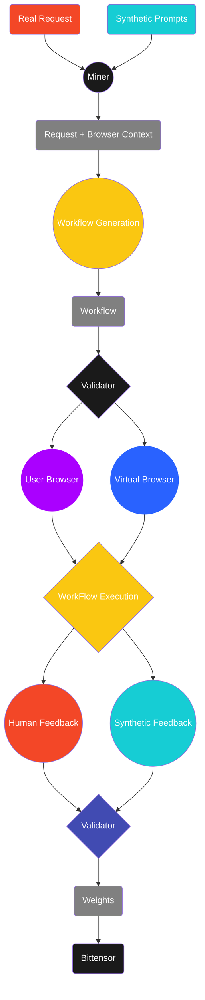

## Incentive Mechanism

As we mentioned, the purpose of this subnet is to create a Browser Assistant that can operate the browser on behalf of users. To achieve this goal we are going to borrow bittensor miners inteligence to achieve a specific goal: solve user requests and find out what tasks and sub-tasks are necessary and how to execute them. Bittensor will allow us to define a specific "incentive mechanism" that ultimately will lead miners to create a better pipeline for solving arbitrary user requests on a browser context. 

## Subnet Pipeline

This pipeline whole purpose is to successfully solve arbitrary user requests on browser context. To do so we have come up we the following phases:

<Steps>
  <Step title="User request definition">
    Which is the user request and which is the browser context associated with that request?. Is
  </Step>
  <Step title="Workflow Generation">
    By leveraging AI + Analytic tools or any other method miners will have to understand the request and "solve" it. By solving we mean finding the exact secuence of "actions" that when executed they will reach the desire outcome by the user. This solution to the request will be called from now on a "Workflow".
  </Step>
  <Step title="Workflow Validation">
    Validators will receive this "workflow" and they will have to execute it on a virtual browser and evaluate how accurate the workflow is to give a score to miners.
  </Step>
</Steps>

 

 

 

<Card title="Request Generation"  href="/browser-assistance-subnet/request-generation">
  Lets explore this pipeline more in depth!
</Card>
